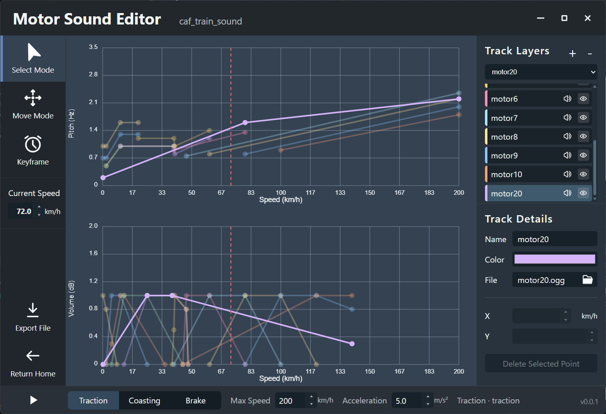

# Motor Sound Editor (MSE)


**Motor Sound Editor** is a professional desktop-first editor designed specifically for BVE-style train content creation. It liberates creators from the tedious task of manually editing raw CSV tables by providing a visual, high-efficiency workflow for building, previewing, and exporting motor sound projects.



---

## 🚀 Core Values

* **Visual Curve Editing**: Interactively edit speed-based pitch and volume curves for both traction and braking behaviors.
* **Real-time Multi-track Preview**: Audition layered motor sounds instantly in different simulator states (Traction, Coasting, Brake).
* **Native Project Management**: Use the `.msep` format to package all audio assets and curve data, ensuring project portability.
* **One-Click BVE Export**: Automatically generate `vehicle.txt`, `motornoise.txt`, and required CSV tables, with built-in audio resampling and format conversion (OGG to WAV).

---

## ✨ Key Features

### Implemented Now
* **Project Lifecycle**: Create new projects, manage recent items with a searchable gallery, and handle unsaved change prompts.
* **Advanced Track Control**: Add, rename, recolor, mute, and hide tracks; assign `wav` or `ogg` audio files directly.
* **Precision Editing**: Switch between select, move, and keyframe insertion tools; edit values numerically via the List Editor.
* **Robust Export Engine**: Supports sample rates from `22050Hz` to `96000Hz` with automatic PCM16 WAV encoding.
* **OS Integration**: Windows-specific single-instance behavior and `.msep` file association.

### Roadmap
* **Expanded Targets**: Future support for OpenBVE and MTR export.
* **Enhanced UX**: Full settings interface and richer project documentation fields.
* **Resilience**: Stronger recovery tools and schema migration for project version compatibility.

---

## 🛠 Tech Stack & Architecture

The app uses a modern decoupled architecture to balance UI responsiveness with native performance:

* **Frontend**: Vue 3 + TypeScript + Pinia, using **Konva** for high-performance canvas-based curve editing.
* **Native Backend**: Rust + Tauri 2, handling file I/O, `.msep` archive management, and audio metadata decoding.
* **Audio Processing**: Powered by the `symphonia` crate for high-quality decoding and resampling during export.

---

## ⌨️ Common Shortcuts

| Shortcut | Action |
| :--- | :--- |
| **Space** | Play / Pause preview playback |
| **W / S** | Step simulator state up (Traction) or down (Brake) |
| **Ctrl + S** | Save current project |
| **Ctrl + Z / Y** | Undo / Redo editing history |
| **Delete** | Remove selected keyframe |

---

## 📦 Getting Started(For Developer)

### Prerequisites
* Node.js & `pnpm`
* Rust toolchain (Cargo)
* Tauri build dependencies for your platform

### Installation & Development
```bash
# Install dependencies
pnpm install

# Run in development mode (starts Vite and Tauri)
pnpm tauri dev

# Build the production desktop application
pnpm tauri build
```

