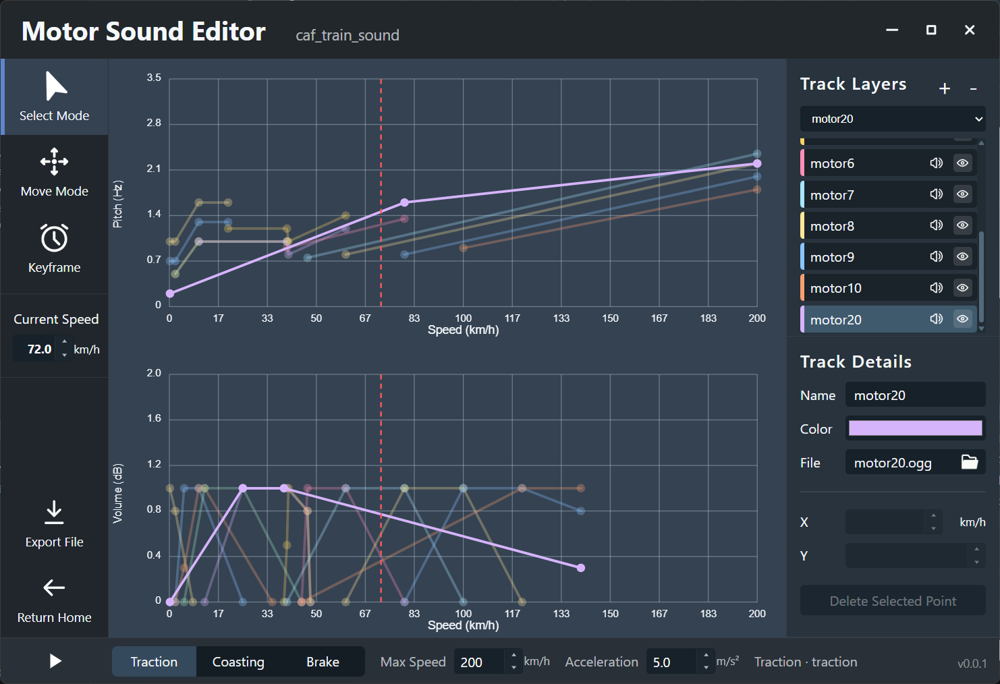

# Motor Sound Editor (MSE)

[](https://github.com/xiangao0904/Motor-Sound-Editor/releases)


[](https://discord.gg/9NDnk3VSsZ)

**Motor Sound Editor** is a desktop editor for creating BVE-style train motor sound projects. It replaces manual CSV editing with visual curve editing, real-time layered preview, portable `.msep` project files, and one-click export for simulator-ready packages.



## Core Features

- **Visual curve editing**: Edit speed-based pitch and volume curves for traction and braking.
- **Multi-track preview**: Preview layered motor sounds while changing speed and simulator state.
- **Portable project files**: Package curve data and audio assets in the `.msep` format.
- **BVE export**: Generate `vehicle.txt`, `motornoise.txt`, CSV tables, and WAV audio.
- **MTR export**: Generate MTR-compatible sound files, `sound.cfg`, CSV tables, and `sounds.json`.
- **Windows integration**: Supports single-instance behavior and `.msep` file association.

## Development

### Prerequisites

- Node.js
- pnpm
- Rust toolchain
- Tauri build dependencies for Windows

### Commands

```bash
pnpm install
pnpm tauri dev
pnpm build
pnpm tauri build
```

## Project Format

`.msep` files are zip-based project archives. They contain project metadata, track and curve data, and packaged audio assets, so projects can be moved between machines without losing referenced audio.

## License

This project is released under the MIT License.
